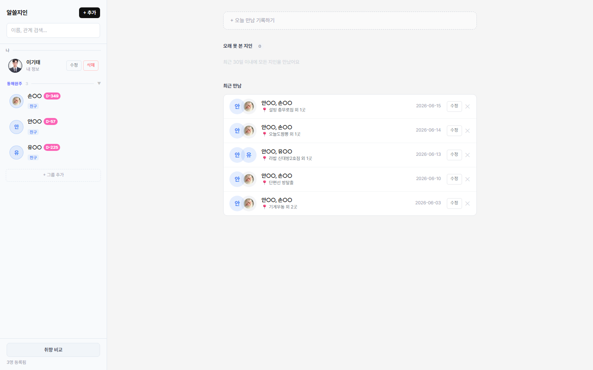
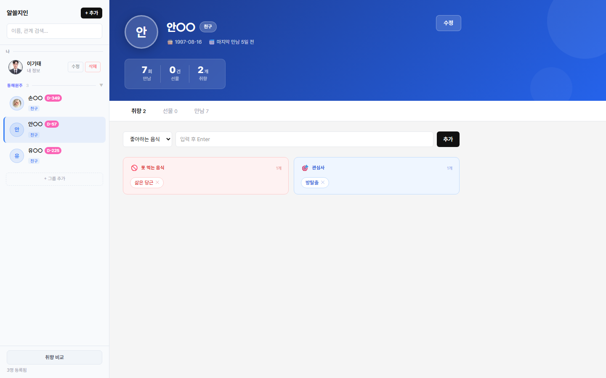
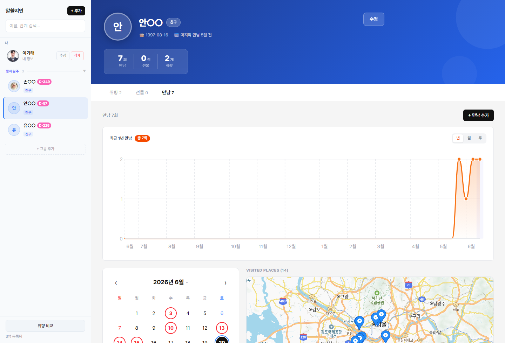
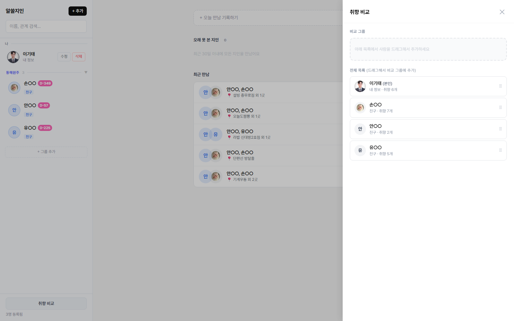
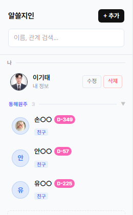

# 알쓸지인

지인별 취향, 선물, 만남 이력을 관리하는 개인용 웹앱

지인이 많아질수록 누가 뭘 좋아하는지, 마지막으로 언제 만났는지 기억하기 어려워지는 문제에서 시작한 프로젝트. 취향·선물·만남 기록을 한곳에 모아두고, 여러 명을 골라 공통 취향을 바로 비교할 수 있게 만들었다.

## 스크린샷

### 홈 대시보드

생일 임박, 오래 못 본 지인, 최근 만남을 한 화면에서 확인. 홈에서 바로 만남을 기록할 수 있고, 같은 날짜·장소 만남은 한 행으로 묶어서 보여준다.



### 지인 상세 — 프로필 헤더

관계별로 다른 그라디언트 색상을 적용한 프로필 헤더. 만남·선물·취향 개수를 통계 바에서 즉시 확인.



### 만남 기록 — 히트맵·달력·지도

최근 1년 만남 빈도를 에리어 차트로 시각화하고, 포인트를 클릭하면 해당 기간의 만남만 필터링. 달력에서 날짜를 고르면 그날 만남만 목록에 표시되고, 오른쪽 지도에는 실제 방문 장소가 마커로 나타난다.



### 취향 교집합 비교

여러 명을 드래그앤드롭으로 비교 그룹에 추가하면, 타입별(좋아하는 음식·관심사 등) 공통 취향과 공유 인원 수를 자동 계산.



### 사이드바 — 커스텀 그룹

지인을 그룹으로 묶어 관리. 드래그앤드롭으로 그룹 배정·순서 변경이 가능하고, 본인 정보는 최상단에 고정.



## 기술 스택

| 분류 | 기술 |
|---|---|
| 프론트엔드 | React 19, TypeScript, Vite |
| 스타일 | Tailwind CSS v4 |
| 지도 | Kakao Maps JS SDK |
| 라우팅 | React Router 7 |
| HTTP | Axios |
| 백엔드 | Spring Boot 4, Java 21 |
| ORM | Spring Data JPA, Hibernate |
| DB | MySQL 8 |
| 테스트 | JUnit 5, Mockito, AssertJ (백엔드) / Vitest (프론트엔드) |

## 주요 기능

- **지인 관리**: 프로필 사진, 관계, 생일, 메모. 생일 D-day 자동 계산
- **취향 데이터**: 좋아하는 음식·못 먹는 음식·알레르기·관심사·선호 브랜드 등 타입별 태깅
- **선물 기록**: 과거 선물 이력 + 위시리스트 구분
- **만남 기록**: 날짜·장소(카카오맵 검색)·메모, 한 번에 여러 장소·여러 지인 동시 등록
- **만남 히트맵**: 연/월/주 단위 필터, 포인트 클릭 시 해당 기간 만남 목록 연동 + 달력 위치로 자동 스크롤
- **장소 평가**: 방문마다 별점(0.5 단위) 기록, 같은 장소는 동행자 무관 전역 평균으로 표시, 재방문 시 직전 별점 자동 채움
- **방문 이력 조회**: 여러 번 방문한 장소는 지도에서 날짜별 동행인 목록을 팝업으로 확인
- **커스텀 그룹**: 사이드바에서 그룹 생성·드래그앤드롭 배정·순서 변경
- **취향 교집합**: 여러 명 선택 시 공통 취향과 공유 인원 수 자동 계산
- **홈 대시보드**: 생일 임박, 오래 못 본 지인, 최근/예정된 만남 한눈에 확인

## 프로젝트 구조

```
Project5/
├── frontend/   # React + TypeScript + Vite
└── backend/    # Spring Boot + MySQL
```

## 실행 방법

**백엔드**
```bash
cd backend
./gradlew bootRun
```

**프론트엔드**
```bash
cd frontend
npm install
npm run dev
```
